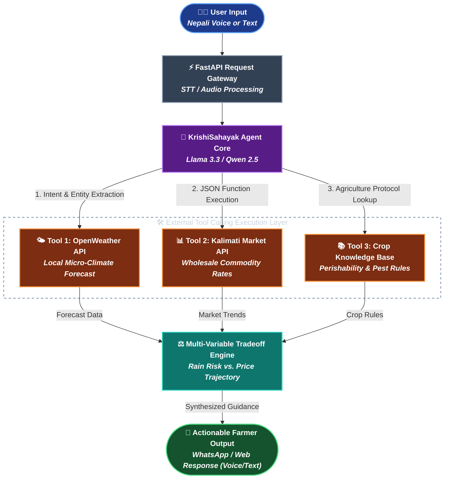

# 🌾 KrishiSahayak (कृषि-सहायक)

> An open-source, AI-powered agricultural decision-support agent built for smallholder farmers in Nepal. Developed as part of **Frogtoberfest 2026**.

---

## 📌 Problem Overview
Smallholder farmers across rural Nepal frequently face severe post-harvest crop losses and unfair market pricing due to a lack of real-time, actionable decision support. Operating without localized weather forecasts or transparent wholesale market price trends (e.g., Kalimati Market rates), farmers often sell at low rates or suffer crop spoilage during unexpected rain.

## 💡 Solution
**KrishiSahayak** bridges this gap by offering a conversational, voice- and text-enabled AI agent. Farmers can ask everyday questions in spoken or typed Nepali—such as whether to harvest crops today or wait until the weekend—and receive clear, actionable decisions powered by live API data and open-weight AI models.

---

## 🤖 AI Transparency & Frogtoberfest Disclosures

In compliance with **Frogtoberfest 2026 Guidelines**:

* **Open-Weight AI Model:** Powered by **Llama-3.3-70B-Instruct** / **Qwen2.5-72B-Instruct** via open inference endpoints (Groq / Together AI). No proprietary APIs (like OpenAI, Claude, or Gemini) are used.
* **Core AI Function:** The LLM acts as an **autonomous tool-calling router and multi-variable decision engine**. It extracts structured parameters from natural Nepali queries, triggers external API tool calls in parallel (weather + market rates), and evaluates conflicting factors (e.g., rain risk vs. price trajectories) to produce optimal harvest windows.
* **Litmus Test Compliance:** The AI model is essential to core operations. Without the open-weight LLM, the system cannot interpret unstandardized spoken/typed Nepali, dynamically route tool calls, or synthesize multi-source trade-off logic.

---

## 🛠️ Tech Stack

* **AI & Agent Framework:** Open-Weight Models (`Llama-3.3-70B` / `Qwen2.5-72B`), LangChain / LlamaIndex / Custom Function-Calling Loop
* **Backend:** Python, FastAPI
* **External APIs & Tools:** 
  * Kalimati Wholesale Market Price API / Web Scraper
  * OpenWeather API / Localized Micro-climate Data
  * Agricultural Crop & Pesticide Guidelines Engine
* **Frontend / UI:** Web App (React / Streamlit) & WhatsApp / Telegram Messaging Interface

---

## 🏗️ Project Architecture & Tool Calling Flow



---

## 🚀 Getting Started

*(Work in Progress — Development actively underway for Frogtoberfest 2026)*

### Prerequisites
* Python 3.10+
* Git

### Local Installation
```bash
# Clone the repository
git clone [https://github.com/YOUR_USERNAME/krishi-sahayak.git](https://github.com/YOUR_USERNAME/krishi-sahayak.git)
cd krishi-sahayak

# Set up virtual environment
python -m venv venv
source venv/bin/activate  # On Windows use: venv\Scripts\activate

# Install dependencies
pip install -r requirements.txt
```

👥 Team
Built by Team KrishiSahayak AI for Frogtoberfest 2026 (Leapfrog Technology).

📜 License
Distributed under the MIT License. See LICENSE for more information.
